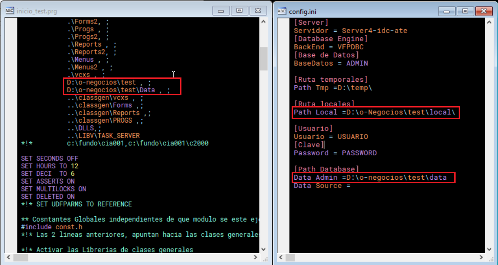

# o-Negocios

Repositorio público para compartir el proyecto AplVfp con la comunidad.

## Pruebas en tiempo de desarrollo

Para realizar pruebas en tiempo de desarrollo, siga los siguientes pasos:

1. **Descargar la base de datos de ejemplo**  
   Ubique el archivo `Bsinfo\DATA\bkTest_20250831004309.rar` en el repositorio y extráigalo en una unidad de disco local.

2. **Ubicar el programa de inicio de pruebas**  
   En el proyecto `bsinfo\proys\o-n.pjx`, localice el programa `inicio_test.prg`.

3. **Configurar el archivo de pruebas**  
   En la carpeta donde se extrajo la base de datos, ubique el archivo de configuración `X:\o-negocios\test\config.ini`, donde `X:` representa la unidad de disco local o unidad de red correspondiente.

4. **Verificar rutas en los archivos de configuración**  
   Asegúrese de que los archivos `inicio_test.prg` y `config.ini` contengan las rutas correctas como se muestra en la imagen adjunta.  
   
