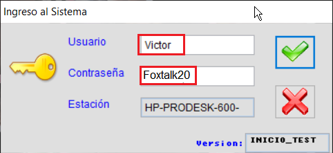
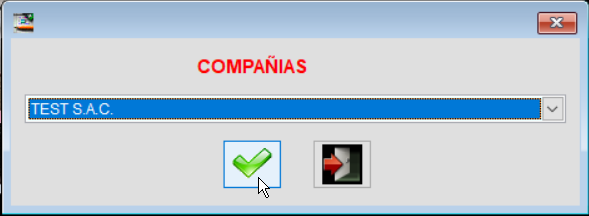
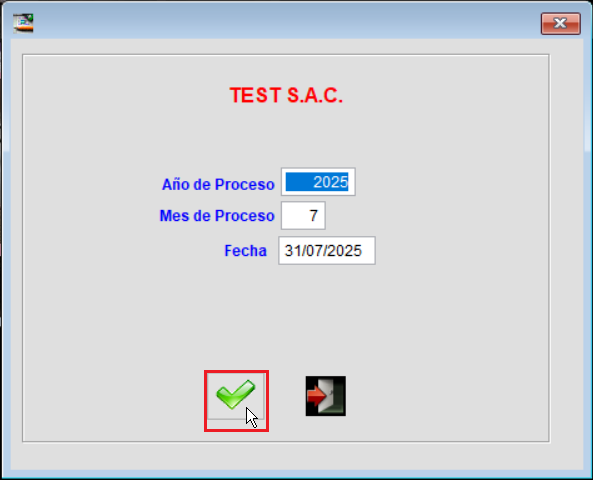
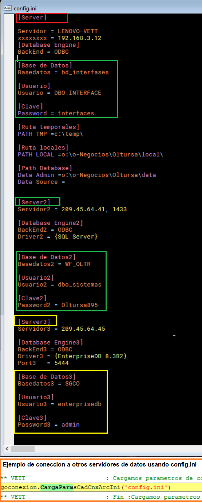

# o-Negocios

## Pruebas en modo desarrollo

Para realizar pruebas en modo desarrollo, siga los siguientes pasos:

1. **Descargar la base de datos de ejemplo**  
   Ubique el archivo `Bsinfo\DATA\bkTest_20250831004309.rar` en el repositorio y extráigalo en una unidad de disco local.

2. **Ubicar el programa de inicio de pruebas**  
   En el proyecto `bsinfo\proys\o-n.pjx`, localice el programa `inicio_test.prg`.

3. **Configurar el archivo de pruebas**  
   En la carpeta donde se extrajo la base de datos, ubique el archivo de configuración `X:\o-negocios\test\config.ini`, donde `X:` representa la unidad de disco local o unidad de red correspondiente.

4. **Verificar rutas en los archivos de configuración**  
   Asegúrese de que los archivos `inicio_test.prg` y `config.ini` contengan las rutas correctas como se muestra en la imagen adjunta.  
   

5. **Secuencia de ejecución del test o prueba**  
   En el proyecto, ubique el archivo `inicio_test.prg` y siga los pasos mostrados en las siguientes imágenes:  
     
     
   

6. **Exploración de programas y formularios disponibles**  
   Puede explorar los programas o formularios disponibles accediendo a los menús en la pestaña "other" del proyecto `o-n.pjx`.  
   A continuación se listan algunos de los menús disponibles:

   - `Bsinfo/menus2/funcbdm00.mnx` → "Contabilidad"
   - `Bsinfo/menus2/funalmm00.mnx` → "Almacén e Inventarios"
   - `Bsinfo/menus2/funvtam00.mnx` → "Ventas y facturación"
   - `Bsinfo/menus2/funcjam00.mnx` → "Caja y Bancos"
   - `Bsinfo/menus2/funcctm00.mnx` → "Cuentas por cobrar"
   - `Bsinfo/menus2/funcmpm00.mnx` → "Logística de compras"
   - `Bsinfo/menus2/funprom00.mnx` → "Control de producción manufacturera"
   - etc.

   Adicionalmente, puede revisar el siguiente video de ejemplo:  
   🎥 [VFP: Cómo Filtrar Cuentas en un Grid para Asientos Contables](https://youtu.be/RQWj48M37_0?si=ELZPbCclY_6NQ4kr)

## Conexión a otros motores de base de datos

El proyecto o-Negocios cuenta con una clase de conexión a base de datos `cnxgen_odbc` ubicada en `classgen\vcxs\admnovis.vcx`, 
que en combinación con la configuración del archivo `config.ini` permite la versatilidad de conectarse a distintos orígenes de 
datos además de las tablas nativas `.dbf` y contenedores `.dbc` de Visual FoxPro, de manera simultánea o independiente.

Ideal para trabajos de interfaces entre diferentes aplicaciones y ecosistemas, así como para tareas de ETL.

A continuación se muestra un ejemplo de cómo se configura en el archivo `config.ini`:  

